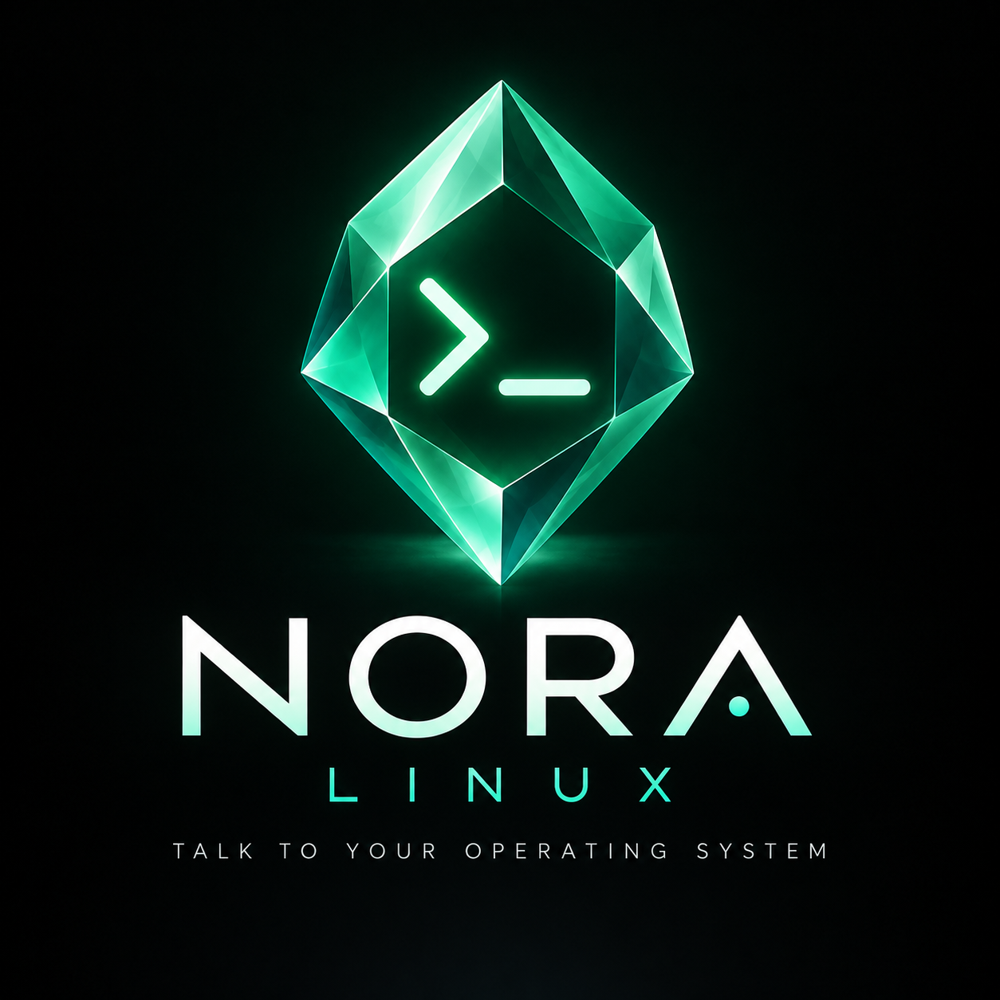

<p align="center">
  <a href="https://noralinux.com/">
    
  </a>
</p>

# NORA Linux

**A little emerald. A more personal Linux.**

NORA is a Debian 13 desktop that brings local AI into the way you use your
computer. Talk through an idea, ask about your system, explore a website, or work
through a task with conversation, visual explanations, and a command terminal
in one workspace. The emerald is NORA's face: a familiar, expressive presence
that responds as she works.

NORA's identity is the operating system itself. Her chat workspace connects that
identity to real system information and visible actions, helping you understand
both an answer and what happens on your computer.

**[Visit noralinux.com](https://noralinux.com/)** ·
[Meet NORA](https://noralinux.com/meet-nora/) ·
[Download a prerelease](https://github.com/jdj333/NORA_Linux/releases) ·
[Chat guide](CHAT.md) ·
[Feature history](FEATURE_LOG.md) ·
[Test feedback loops](TEST_FEEDBACK_LOOPS.md)

## Raspberry Pi 5 edition

NORA now has a separate **ARM64 Raspberry Pi 5 image build**, with the same
emerald desktop, local chat, canvas and offline voice. Flash the `.img.xz` image
with Raspberry Pi Imager; the PC `.iso` is not compatible with the Pi.
See [Raspberry Pi setup, build instructions and hardware test checklist](RASPBERRY_PI.md).
Physical Pi 5 validation is still required.

## One workspace for conversation, ideas, and action

NORA Terminal opens maximized when you log in. Its dark forest surfaces, mint
accents, and bundled DM Sans and Space Grotesk fonts keep the interface quiet
and readable, even offline.
The bundled NORA startup song plays once when the chat window opens, through
the desktop's default audio output. Closing the window stops the music.

- **Conversation:** chat with the bundled local Qwen2.5 0.5B model. No API key or
  internet connection is needed for local conversation after boot.
- **A shared visual canvas:** NORA communicates concepts through connected nodes,
  arrows, decision shapes, and images alongside her written replies. The canvas
  is a place to explain relationships and develop ideas together, not a view
  into the model's private reasoning.
- **A separate command terminal:** see commands, output, and exit status below
  the canvas. It starts collapsed to leave room for visual work. Explicit
  `/run` commands execute locally; model-proposed commands can be reviewed and
  edited before choosing **Run**.
- **Awareness of her system:** ask NORA about disk space, memory, or the running
  OS and receive answers based on live system measurements.
- **Web access when online:** read website text for follow-up questions and
  bring sourced images from Wikimedia Commons or an image URL onto the canvas.
- **Saved conversations:** return to chats in the left sidebar, with their own
  drafts, context, terminal output, and canvas. Settings includes
  **Clear all history and contexts**.
- **Optional local voice:** enable the Voice toggle to listen and speak with
  Moonshine and Kokoro. Voice and microphone access start off; speech stays on
  this computer. See [VOICE.md](VOICE.md) for controls and audio setup.
- **An emerald with expression:** NORA smiles when ready, gently pulses while
  processing, and reacts to incoming reply text. Animation can be disabled.

For example, try:

- “How much disk space do you have?”
- “Help me plan a small Linux project.”
- “Look up noralinux.com.”
- “Show images of emerald crystals.”

See [CHAT.md](CHAT.md) for controls, web and image commands, storage details, and
command limits.

## Current status and supported hardware

NORA is a working prototype built on **Debian 13 (Trixie)** with an Xfce desktop.
It tracks Trixie, security, and point updates rather than Debian testing or a
future major release.

The PC build is an **amd64 live ISO for Intel/AMD PCs**, with hybrid USB/DVD
support, BIOS and UEFI boot entries, and Debian's live installer. It does not boot
on Raspberry Pi or other ARM devices; use the separate [Pi image](RASPBERRY_PI.md). Secure
Boot and physical hardware compatibility still require testing.

Interaction supports **typing and local voice**. Speech loads at startup and reads chat replies aloud in English.
The microphone defaults off; enable Mic on separately to speak to NORA.
Use the voice toggle to turn spoken replies off. The small language model can make mistakes, and it uses
image captions and website text rather than seeing images itself.

Chats are stored locally and survive application restarts. Keeping them across
reboots requires an installed system or persistent storage; a temporary live
session loses its history when shut down. Local chat works offline, while reading
websites and finding web images requires a connection.

The first ISO and verification evidence are in `dist/`. See [VALIDATION.md](VALIDATION.md)
for the tested artifact, checksum, and remaining validation.
The current system-aware chat ISO is `dist/nora-linux-13-system-amd64.hybrid.iso`;
see [OS_ACCESS_VALIDATION.md](OS_ACCESS_VALIDATION.md) for its checks and checksum.
[CHAT_VALIDATION.md](CHAT_VALIDATION.md) records the earlier conversation-only image.
Read [LEARNING.md](LEARNING.md) before rebuilding for reusable commands and known gotchas.

## GitHub Actions releases

[Build and release NORA ISO](https://github.com/jdj333/NORA_Linux/actions/workflows/build-iso.yml)
runs on pushes to `main`, or manually with **Run workflow** on `main`. Each successful
run publishes a new [GitHub prerelease](https://github.com/jdj333/NORA_Linux/releases)
tagged `build-RUN_ID-ATTEMPT`, targeting the exact source commit. Builds use a native
amd64 runner and the Debian 13 Docker builder, including the pinned offline model.
No additional repository secret is needed: publishing uses GitHub's built-in token.

The workflow runs tests, checks BIOS/UEFI ISO structure and the internal SHA-256
manifest, then uploads all assets to a draft before publishing it. These checks do
not replace VM boot or installation testing. Build logs remain Actions artifacts
for 14 days, including on failure. A failed upload leaves an unpublished draft;
rerunning creates a new attempt tag without overwriting a published image.

GitHub's [release asset limit](https://docs.github.com/en/repositories/releasing-projects-on-github/about-releases)
is less than 2 GiB per file, so the ISO is stored in numbered parts of at most
1,900 MiB. Download all parts and both checksum files from **one release** into an
empty directory, then reconstruct the ISO on macOS or Linux:

```sh
shasum -a 256 -c SHA256SUMS.parts
cat nora-linux-13-amd64.hybrid.iso.part-* > nora-linux-13-amd64.hybrid.iso
shasum -a 256 -c SHA256SUMS
```

Require every checksum to report OK. Boot or flash the reconstructed `.iso`;
individual parts cannot boot. Each release includes these instructions, installed
package versions, verification reports, and the source commit/build URL.

## Build on Debian 13 amd64

Allow at least 25 GB free disk and 4 GB RAM. Package mirrors require internet access.

```sh
sudo apt-get update
sudo apt-get install live-build debootstrap ca-certificates xorriso isolinux \
  syslinux-common grub-pc-bin grub-efi-amd64-bin mtools dosfstools squashfs-tools \
  file rsync xz-utils zstd bzip2 python3
python3 scripts/prepare-llm.py
python3 scripts/prepare-voice.py
sudo apt-get install python3-pip
python3 -m pip install --only-binary=:all: --require-hashes \
  --target config/includes.chroot/opt/nora/voice/python -r scripts/voice-requirements.txt
sudo ./scripts/build.sh
```

Use a fresh checkout/build directory for each release. To rebuild a used tree,
run `sudo lb clean --purge` before configuring again.

## Docker / macOS

The build needs privileged Linux mount operations. Run only on a trusted local
Docker VM. An ARM Mac requires amd64 emulation; a native amd64 Linux builder is
preferable. No host filesystem is mounted into this privileged container.

```sh
python3 scripts/prepare-llm.py
python3 scripts/prepare-voice.py
docker build --platform linux/amd64 -t nora-builder:trixie .
docker run --name nora-iso-build --platform linux/amd64 --privileged nora-builder:trixie
mkdir -p dist
docker cp nora-iso-build:/build/dist/. dist/
```

The stopped container retains build diagnostics. Remove it explicitly before
reusing the same name. Output: `dist/nora-linux-13-amd64.hybrid.iso`, build log,
and `SHA256SUMS`. Mirror contents change, so builds are not byte-reproducible.

Preparing the LLM requires Python 3.12+ and downloads about 508 MB from the
official upstream projects. Downloads are checksum-pinned and cached in `.build/`.
Generated runtime/model files are included in the image but ignored by Git.
Voice adds about 251 MiB of model assets plus its runtime; see [VOICE.md](VOICE.md).

## Validation before release

`scripts/build.sh` checks the finished ISO for BIOS and UEFI boot records and
the live kernel, initramfs, and SquashFS. The report is saved in
`dist/iso-structure.txt`. Run the same check separately with:

```sh
./scripts/verify-iso.sh dist/nora-linux-13-amd64.hybrid.iso
```

Boot the ISO in both BIOS and UEFI VMs. Check the NORA desktop, wallpaper,
networking, audio, live session, and shutdown. Test installation only onto a
disposable virtual disk, then reboot without the ISO and check APT upgrades and
branding persistence. Test real target hardware and Secure Boot separately.
The live user is `nora`; Debian live-config's default live password is `live`.
The installer must create the installed user's own account and password.

## Customization

- `auto/config`: Debian suite, architecture, boot options, installer, ISO identity.
- `config/package-lists/desktop.list.chroot`: included software.
- `config/includes.chroot`: system defaults and NORA theme.
- `config/hooks/live/0900-nora.hook.chroot`: identity and desktop setup.
- `config/hooks/live/0950-nora-menu.hook.binary`: live boot-menu labels.
- `scripts/Dockerfile.verify`: QEMU test environment, native to the builder host.
- `scripts/qmp.py`: QEMU monitor helper for boot status and screenshots.
- `logo.png`: original artwork; copy it to the NORA backgrounds directory after changes.

Debian repositories provide upstream updates. Custom NORA files currently live
in the image; they need a versioned package and signed repository before an
ongoing public update service. Keep component license notices and satisfy source
distribution obligations before publishing. Non-free firmware is enabled for
hardware compatibility and has component-specific licensing.

References: https://www.debian.org/derivatives/ and
https://live-team.pages.debian.net/live-manual/html/live-manual.en.html
